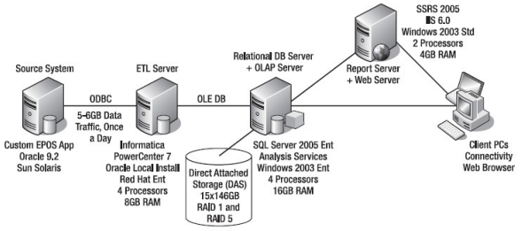

# Arquitetura de DW

DW tem duas arquiteturas principais:
1. Arquitetura do Fluxo de dados
    * Onde e como os dados são armazenados, o fluxo dos sistemas até os repositórios
      
    * Configuração dos repositórios
    * Controle, log e monitoração dos dados para garantir qualidade dos dados
    * 3 arquitetures:
        * DDS
        * NDS + DDS
        * ODS + DDS
    * Diferente de arquitetura de dados (modelagem de dados)
      
    ## Repositórios
    * Componentes importantes da arq. de fluxo de dados
    * Uma ou mais bases com dados
    * Pode se classificar em relação ao acesso aos dados:
        * User-facing: Disponível para usuários e aplicações
        * Interno: Usado internamente no fluxo (preparar, logar, limpar etc.)
        * Híbrido: User-facing e Interno
    * Classificações em relação ao formato de dados:
        * Stage - Interno - Transformar e preparar dados dos sistemas fontes
        * NDS - Normalized Data Store - Interno - Uma ou mais bases normalizadas para integrar dados de várias fontes em Stage
        * ODS - Operational Data Store - Híbrido - Uma ou mais bases relacionais - Dados de transações, pode usar para aplicações operacionais, versão mais recente dos dados principais
        * DDS - Dimensional Data Store - User-facing - Dados arranjados em formato dimensional para suportar consultar analíticas
    > Base de dados relacional - Com relacionamentos  
      
    > Base de dados normalizada - Pouca ou nenhuma redundância de dados  
      
    > Base de dados desnormalizada - Com alguma redundância  
      
    > Base de dados dimensional - Tabelas fatos e dimensões  
      
    > MDB - Multidimensional - Base com várias dimensões de um mesmo dado
      
    > ETL - Extract, Transform, Load - Sistema que lê dados de um repositório, transforma, e carrega em outro repositório  
      
    > Data Quality - Atividades e mecanismos para garantir que os dados estão corretos e completos - Alertas, avisos para reportar problemas e ou inconsistências - DW ajuda muito a base de produção porque pega os erros antes  
      
    > Data Firewall - Firewall com regras e inteligência para garantir o Data Quality   
      
    > Control + Audit - Sistema que controla e audita o ETL
      
    > Metadata - Contém descrição de estruturas, dados e processos dentro de um DW
      
      
    **Arquitetura de fluxo de dados é uma das primeiras coisas decididas na construção de DW**  
      
    Determina componentes a serem construídos  
    Planejado para cumprir requisitos de dados das aplicações  
    A partir daqui se define o ETL para obter os repositórios desejados  
      
    ### Arq. Completa
    

    ### Arq 1: DDS Simples
    * Um DDS com Stage
    * Um só repositório dimensional, com um ou mais data marts dimensionais
    > Data Mart é um grupo de tabelas fatos relacionadas e suas tabelas dimensões correspondentes
      
    
      
    Vantagens:
    * Construção mais simples
    * Dados carregados sem passar por uma etapa de normalização
    * Mais simples e ETL mais rápido 
    Desvatanges:
    * Mais difícil de criar um segundo DDS
    * DDS não costuma ser muito grande, mas tenta atender vários usos
    * Não tem como reaproveitar os ETLs existentes (um para cada DDS)
    Quando usar:
    * Quando só precisa de um DDS
    * Para soluções BI simples
    * Bem aplicável quando se tem uma fonte de dados (sem necessidade de integração grande)

    ### Arq. 2: NDS + DDS
    * State + NDS + DDS
    * Similar ao DDS Simples, mas tem o NDS
    > NDS tem dois objetivos básicos: Integrar dados de várias fontes e permitir carregar dados em diversos DDS
    * Permite vários DDS
      
    
      
    * NDS é o repo principal, com todas os conjuntos de dados completos, históricos de transações e versões de master data
    * Diferente do DDS que não é o principal, porque não tem todos os dados de transações
    * NDS com versões históricas, sem update, um registro novo + versão antiga

        ### NDS
        Similar aos OLTP (Sistemas transacionais), com dois tipos de tabelas:
        * Tabelas Transação - Com transação ou evento de negócio
        * Tabelas Master - Pessoas ou objetos envolvidos no evento de negócio
        > As tabelas fatos do DDS são carregadas a partir das tabelas de transação da NDS  
        
        > As tabelas dimensões do DDS são carregadas a partir das tabelas master da NDS  
      
    * ETL para carregar DDS mais simples
    * Mais fácil de parametrizar e padronizar o ETL de acordo com os metadados da tabela
    * NDS com as surrogate e natural keys

    Vatangens:
    * Facil de criar mais DDSs
    * ETL mais parametriável e reutilizável
    Desvantagens:
    * Dá mais trabalho, complexo
    * Modelo de dados maior
    Quando usar:
    * Quando precisa de vários DDS
    * Quando é necessário integrar dados de forma normalizada

    ### Arq. 3: ODS + DDS
    * Assim como NDS + ODS, tem as tabelas transação e master
    * O ODS é híbrido
    * Aplicações podem ler dados do ODS, que podem rodar UPDATE etc.
    * Sem atualizar dados das fontes, mas mexendo nos dados gerados pelo DW
    * DDS como repositório principal, assim temos apenas um DDS

    

    Vantages:
    * Até terceira forma normal
    * Atualizável por aplicações
    Desvantagens:
    * Precisa partir do DDS, porque ele é o principal, o ODS pode ter sido alterado
    Quando usar:
    * Quando se deseja o ODS para uso em outro sistema (uso mais difícil)
2. Arquitetura do Sistema
    * Configuração física dos componentes
    * Arranjo físico e conexões entre servidores, redes, softwares, storage e clientes
    * Segurança, desempenho, SAN, RAID, backup, servidores

    

    Tempo passa e temos novas tecnologias, mas a base é a mesma