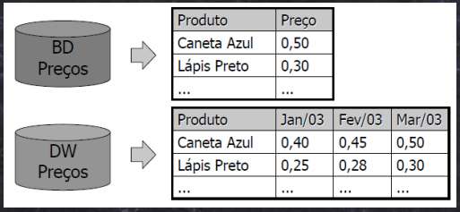
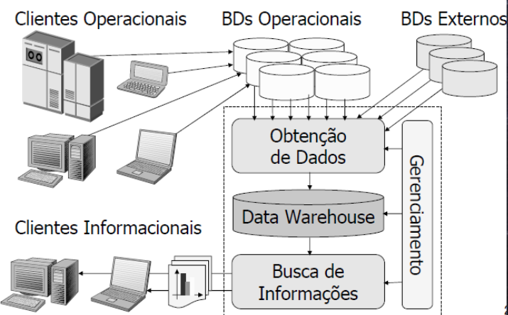

# BI

## Processo decisório
Analisar o passado (informações históricas, experiências acumuladas)
Bolar planos para executar e atingir objetivos  
**Tomada de Decisão**  
Gerar simulações  

Dados = 80%  
Informação = Dado + Contexto = 15%  
Inteligência = Conhecimento = Informação + Análise = 5% (Tomada de decisão)  

### Sistema Transacional x Suporte à decisão

1. Transacional
- Operacional
- CRUD
- Online
- App
2. Decisão
- Informações estratégicas
- Consultas complexas com grandes volumes de dados
- Em geral é alimentado do transacional, mas pode ser de outros
- Poucos updates, raro

## DW
- Armazém de dados
- Voltado à tomada de decisão
- Derivada de bancos de dados operacionais
- Pode ser usado como base para OLPA e extração/análise de conhecimento/informação

- Satisfazer necessidades de análise de informação
- Monitorar e comparar atual com o passado
- Estimar futuro

> Dados orientados a assuntos, integrada, voltada à tomada de decisão
> Extrai, limpa, ajusta e carrega dados
> Temporal, séries temporais, não volátil (Não muda, fica registrado)

> Data Warehousing: Processo de construção e suporte de DW
> BI: Tela que o gerente olha para tomada de decisão

### Características

1. Orientado a assuntos
- Vendas de produto
- Vendas da loja
- Atendimento
- Diagnósticos de pacientes
- Rendimento de estudantes

2. Integrado
- Diferentes fontes/tipos de dados organizados em uma visão unificada e consistente
- Tem várias informações que podem ser entendidas no conjunto e separados

> Esqueça Forma Normal (FN), em BI a ideia é armazenar informações temporais

3. Séries temporais
- Armazena por um tempo superior ao usual comparado com os bancos transacionais

4. Não volátil
- Não são modificados que nem nos sistemas transacionais
- São carregados apenas e acessados para leitura
- Só alterados para correções, mas no geral não tem, quando maduro o sistema dificilmente acontece

## Transacional x Dimensional
1. Objetivo: Atividades cotidianas x Análise de negócio
2. Uso: Operacional x Informativo
3. Processamento: OLTP x OLAP
4. Unidade de trabalho: CRUD x Carga e consulta
5. Usuários: Operadores (muitos) x Gerência (poucos)
6. Interação dos usuários: Ações pré-definidas x Pré-definida e ad-hoc (customização)
7. Dados: Operacionais x Analíticos
8. Volume: Pode ser alto (MB - GB) x Muito alto (GB - TB)
9. Histórico: 60 a 90 dias x Vários anos
10. Granularidade: Detalhada (baixa) x Detalhada e consolidada (alta)
11. Redundância: Não ocorre (só p/eficiência) x Pode ocorrer
12. Estrutura: Estática x Variável
13. Manutenção: Mínima é o desejável x Constante
14. Atualização: Contínua (tempo real) x Periódica (snapshots - retratos)
15. Integridade: Transação x Cada atualização
16. Acesso a registros: Poucos - por transação x Muitos - para consolidação
17. Índices: Poucos/simples x Muitos/complexos
18. Função dos índices: Localizar um registro x Agilizar consultas

### Modelagem 3FN x Dimensional

3FN  
* Tabelas separadas e relacionadas
* Sem repetição
* Entidades distintas, difícil olhar uma tabela e extrair informação de negócio
Dimensional  
* Junta as tabelas de acordo com o assunto, com o interesse de análise
* Agrupa fatos relevantes a um mesmo processo de negócio
* Ver dados abstratos e extrair informação e conhecimento de forma tangível

## Requisitos de um DW
* Informações acessível
* Consistência dos dados (sem update, precisa bater entre diferentes fontes)
* Adaptável e flexível às várias fontes
* Controle e segurança dos dados
* Suporte à decisão

## DW x Data Mart
Data Mart tem o mesmo conceito de DW, diferenciando no conteúdo
Data Warehouse é um conjunto de Data Marts integrados

## Vocabulário
* Medida - Info numérica
* Tabela fato - Principal tabela que armazena as medidas (Surrogate key e medida)
* Tabela dimensão - Informação descritivas e qualificadores do negócio. Entrada do DW (Surrogate key + descrições + negócio + medida consolidada ou não)
* Grão - Menor nível de informação existente (Identificada pela Surrogate Key)
* Surrogate Key - Chave substituta gerada no DW. PK das tabelas
* Business Key - PK do transacional. Chave de negócio. Mais de uma surrogate key pode ter a mesma business key (forma de ter um histórico, mesma PK transacional com 2 surrogate indica um histórico de negócio que foi alterado).
* Hierarquia - Atributos com ordem lógica do maior ao menor nível
* Atributo - Campo descritivo de uma dimensão

> Segredo do BI é entender o que as pessoas querem saber

## Análise multidimensional
* Gerentes pensam de forma multidimensional
* BI formata de forma multidimensional
* Querem ver números que dê para entender rápido o que ele quer
* Fácil de usar a informação
* Reduz o custo de gerar e manusear uma informação. Para cada novo indicador você tem uma multiplicação na quantidade de combinações a serem analisadas