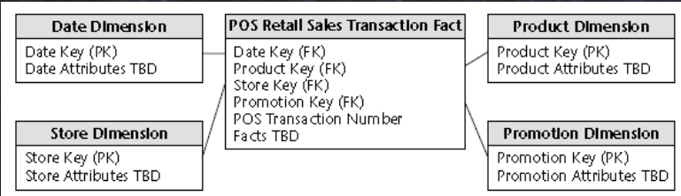
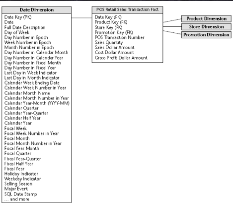
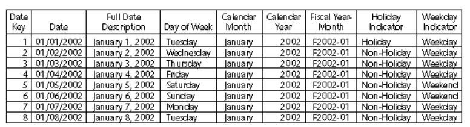
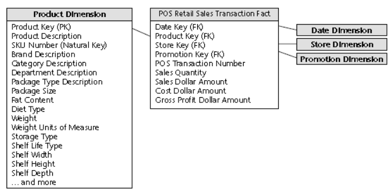
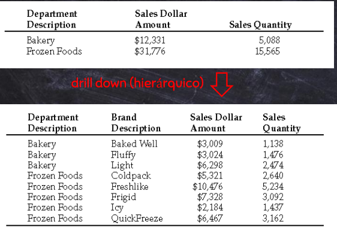
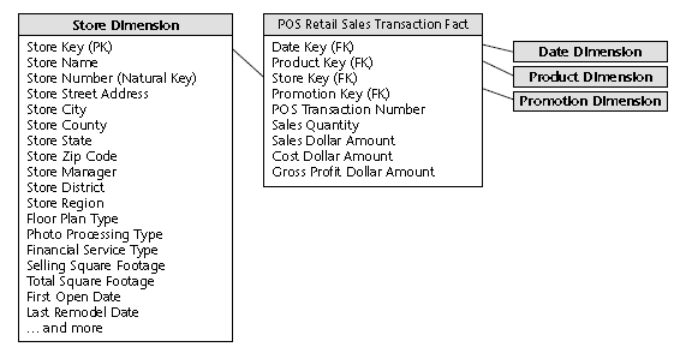
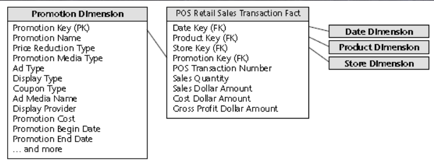
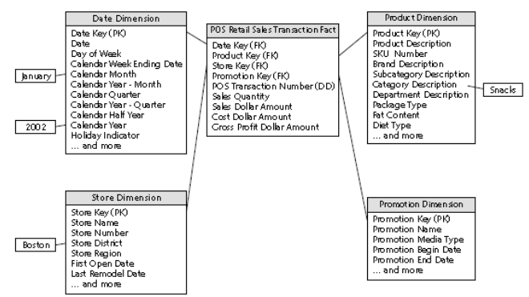
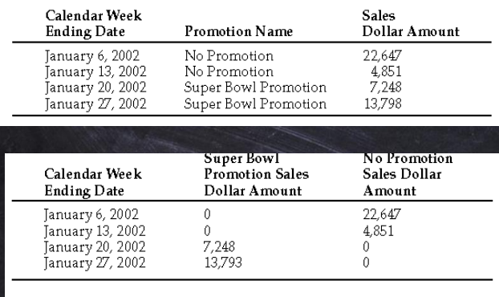

# Modelagem Dimensional

Sobre como partir dos requisitos de negócio e informações reais e chegar no modelo dimensional:  
  
## Passo a passo da modelagem:  
1. ### Business Process  
    **Selecione o processo de negócio a ser modelado**, ou seja, a **atividade de negóci**o da organização (geralmente suportada por sistemas transacionais).  
    A ideia é pensar na **atividade domínio** a ser explorada, não no departamento ou função da empresa (se pensar por departamento há a chance de duplicar dados usando diferentes terminologias para o mesmo dado em departamentos diferentes, ou seja, ajuda a **evitar duplicação de dados**)  
    Ter um processo selecionado **economiza**:
    * **Menos ETL**
    * **Gestão**
    * **Manutenção**
    * **Espaço em disco**
2. ### Grain  
    **Declare o grão do processo de negócio**  
    * Definir o que uma linha da tabela fato representa
    * Exemplos:
        * Um **item** da nota fiscal do **cliente** de um **varejista**
        * Um **item** de uma **conta** de **restaurante**
        * Uma **passagem** para um **vôo**
        * Uma **foto diária** dos **níveis de estoque** para **cada produto** em um armazém
        * Uma **foto mensal** para **cada conta** bancária
3. ### Dimensions
    **Escolha as dimensões que se aplicam a cada linha da tabela fato**  
    * Como os usuários descrevem os dados resultantes do processo de negócio?
    * Buscar representar todas as possíveis descrições no contexto de cada medição para associar com a tabela fato
    * Costumam ser identificadas facilmente a partir do grão
    * Escolhendo uma dimensão, definimos seus atributos
    * Exemplos:
        * Data
        * Produto
        * Cliente
        * Tipo de transação
        * Status
    
4. ### Facts
    **Identifique os fatos numéricos que irão popular cada linha da tabela fato**
    * O que estamos medindo
    * Os fatos devem ser verdadeiros para o grão
    * Se o fato se encaixa em outro grão, então não deve se juntar a esse
    * Costumam ser numéricos e aditivos, como quantiodades e valores de custo

## Estudo de caso - Varejista
Supermercado com 100 lojas espalhadas em cinco estados, em que cada loja possui departamentos como: doces, comidas congeladas, açougue, flores, limpeza doméstica etc.  
Cada loja com aproximadamente 60.000 produtos específicos (SKU), dentre os quais 55.000 são de manufaturas externas e 5.000 são de departamentos como açougue, panificadores etc.  
Dados podem ser coletados de diversos pontos, mas para o negócio o que importa são os dados de produtos comprados pelo cliente coletado pelo scanner das caixas (POS).  
Para obter lucro, a empresa abaixa os custos de aquisição e processamento, atraindo clientes para um ambiente de preços competitivos.  
Para tomar decisões gerenciais, levam em conta preços e promoções.  
1. Processo de negócio  
* Como querem entender melhor as compras capturadas nos POS, o processo de negócio será: **Vendas a Varejo no POS**
* Podemos analisar a partir disso quais produtos são vendidos em quais lojas em que dias e atrelados à quais promoções
2. Declarando o Grão:
* O dado mais granular nesse caso é: Item específico em uma transação do POS (uma compra no caixa)
* Esse grão permite maior dimensionalidade e flexibilidade
3. Escolhendo Dimesões:
* A partir do grão temos: **Data, Produto e Loja**
* Podemos adicionar outras dimensões, como **promoção e número de transação POS**
### Dimensão Generalizada
Nesse estudo de caso, a dimensão do Número de transação POS se classifica como **Dimensão Degenerada**.  
Isso ocorre porque, apesar dela originar do registro chave da venda no sistema transacional, levando a dados como data de compra, loja etc., dado que as demais dimensões passaram a conter essas informações (data, produto, loja etc.), ela se torna uma dimensão vazia (sem atributos).  
Esse dado é útil, pois permite agrupar as vendas de uma transação, de forma que esse tipo de dado que tende a representar transações ou itens, costumam se tornar uma dimensão degenerada também.  
> Dimensão Degenerada - Existe apenas na própria tabela fato, ou seja, não possuem uma tabela de dimensão para relacioná-la
4. Identificando os Fatos:
* Quatro deles são **aditivos** (quantidade, total de venda, total de custo e lucro bruto)
    * > Aditivo: Qualquer soma ou combinação é válida e correta
* Preço unitário é um fato também, mas **não-aditivo**. Poderia ser uma parte da dimensão produto
    * > Não-aditivo: Somar ou combinar os valores resulta um número sem significado, independente da combinação de dimensões analisada
    * > Semi-aditivos: Dependendo da combinação de dimensões pode ou não resultar em um número válido
### Dimensão Promoção
Ela se classifica como **Dimensão Causal**, dado que descreve fatores que alteram a venda de um produto.  
Para tratar as vendas sem promoção, é comum adicionar uma linha na tabela representando "Nenhuma promoção", para evitar o NULL na tabela fato.
### Modelo final

