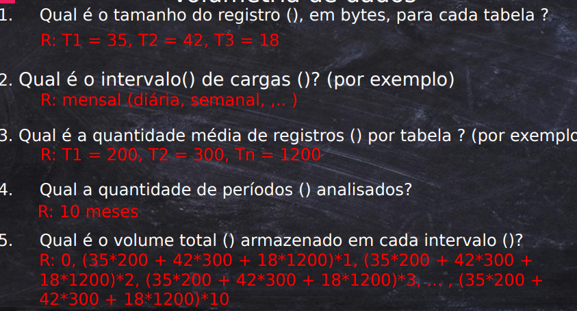

# Volumetria
* Carga Inicial - Trazer os dados do banco transacional pela primeira vez para o Data Mart
    * Incrementais: Podem ser mensais, diárias, de hora em hora  
Em geral os dados são da Fato, 90% exagerando (10% das dimensões).  
Conforme o tempo vai passando a fato cresce mais ainda. Enquanto as dimensões nem mudam.  
* Conhecer a dinâmica de adição de dados em um DW é importante
* Importante saber isso para estimar os limites de capacidade de armazenamento independente do modelo de infra adotado (onpremise ou cloud)
    * De acordo com o cartesiano que dar, com meses vai crescendo muito muito rápido.  
## Pontos a serem considerados
* Conhecer o volume de dados inseridos em um Data Mart
1. Uma abordagem: Considerar um questionamento ao time de negócio acerca da produção periódica de dados (ex: quantas vendas por dia, quantos produtos em média? 100 mil itens adicionais em x tempo)
2. Investigar a base de dados operacional existente e define o tamanho de dados que pode aguentar.
### Calcular o tamanho do registro de uma tabela
* Cada DB adota uma estratégia para armazenar os dados do disco rígido
    * SQL Server limita a linha em 8060 bytes paginando por blocos, ou seja, cada MB contém 128 páginas
* Realizar o cálculo de volumetria considerando o banco de dados específico, parece ser preciosismo, por ser uma abordagem numérica de caráter aproximativo.
1. Saber o tamanho de cada registro
2. Para isso vamos precisar saber o tamanho de cada campo  
    Tabela de tipos de dados e espaço ocupado:
    
    Obs: Se precisar usar string como PK, usar CHAR ao invés de VARCHAR, a árvore binária é mais eficiente.  
    Obs: Varchar2 é melhor porque não vai ocupar tudo se não usar, comparado ao CHAR
3. Índices ocupa muito espaço também. 30% costuma ir em índice. +130% para PK com backup. +130% para réplica caso tudo caia. Ou seja, um banco de 1 TB vira quase 4 TB.  
    Geralmente é x4 o espaço do banco de produção esperado.
### Exemplo:
1. Tabela Data: ID = 4 bytes, diasemana 45 bytes (sempre é bom pecar pelo excesso), data 7 bytes, dia 4 bytes, mês 4 bytes, ano 4 bytes. Total de 68 bytes.
2. Local: ID 4 bytes, pais 45 bytes, estado 45, cidade 45, cinema 45, sala 45, capacidade 4. Total de 233 bytes por registro.
------
  
1. **Carga de dados inicial**:
    * Pode ser dividida em algumas fases, permitindo testes antes.
    * É comum que seja feito de forma manual com o time de TI, para depois automatizar com ferramentas.
2. Cálculo matemática: Somatória do tamanho em bytes do registro da tabela j vezes a quantidade de linhas. Isso para cada tabela. Lembrando dos índices e das tabelas do DW.  

  

### Carga Periódica
A partir da carga inicial, o ETL vai surgir e vai começar a inserir registros periodicamente.  
Toda semana, todo dia, todo mês temos novos registros na Fato.  
É quem vai fazer o BI engordar, todo santo dia, toda semana etc.  
É preciso justificar esse crescimento para pagar os TB que vão sendo usados.  
  
**A diferença com a carga inicial para a periódica**: A inicial traz todo o legado, a periódica são incrementos.  
**Mesmo fórmula**, porque é a mesma ideia. A única diferença é que só consideramos **as linhas a serem incrementadas**.  
Tende a ser pequena, mas que vai acontecer o tempo todo, de forma que tende a ser maior que a inicial com pouco tempo.  

1. Qual o intervalo de cargas?
2. Qual a quantidade média de registros por tabela?
3. Qual a quantidade de períodos analisados?
4. Qual o volume total armazenado em cada intervalo?

  
Obs: Podemos trabalhar com médias diferentes de incremento por mês. Exemplo: Janeiro e Julho que é quando tem mais venda talvez. Mas perceba que se analisarmos no ano, vai dar na mesma.  
Na maioria dos casos a média fixa acaba funcionando.  
Podemos sair calculando caso a caso dos meses anteriores, para somar e ter o volume atual, mas na média vai dar quase na mesma.  
